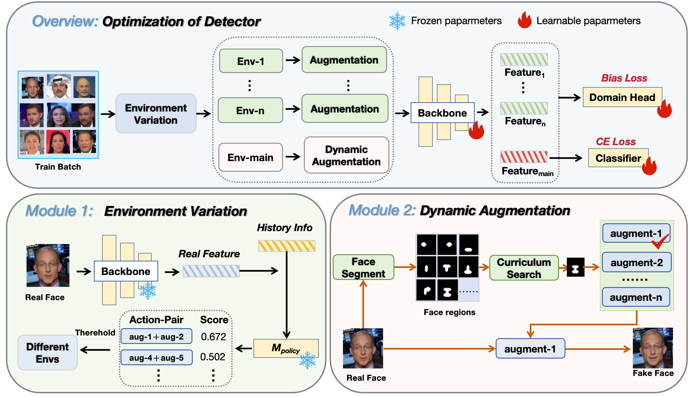
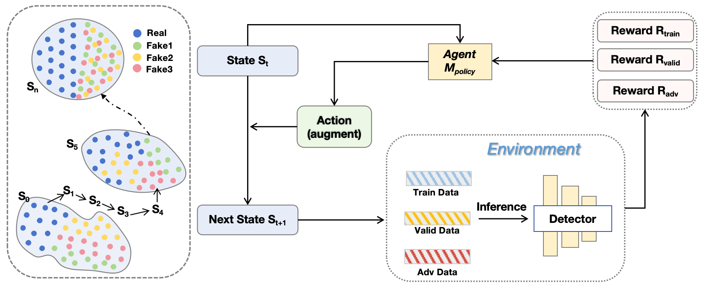

# ProDet
The official code for paper "[Improving Deepfake Detection with Reinforcement Learning-Based Adaptive Data Augmentation]" 


We propose a novel framework named CRDA (Curriculum Reinforcement-Learning Data Augmentation) to enhance the generalization capability of deepfake detectors by dynamically selecting data augmentation strategies through reinforcement learning and causal inference, guiding the detector to progressively master multi-domain forgery features. We demonstrate that CRDA significantly improves the detector’s performance on multiple cross-domain datasets, achieving superior results compared to state-of-the-art methods.



ProDet is implemented within the framework of [DeepfakeBench](https://github.com/SCLBD/DeepfakeBench). The provided code should be placed in the corresponding folders in DeepfakeBench, and test/train on DeepfakeBench as well. 

There is no additional package required beyond DeepfakeBench and this repository, hence you should easily reproduce the training of our paper with an established DeepfakeBench environment as:

```python
python3 -m torch.distributed.launch --nproc_per_node=4  training/train_ppo.py --detector_path ./DeepfakeBench/training/config/detector/CRDA_detector.yaml --detector_path2 ./DeepfakeBench/training/config/detector/ppo2.yaml --no-save_ckpt --no-save_feat --ddp
```
